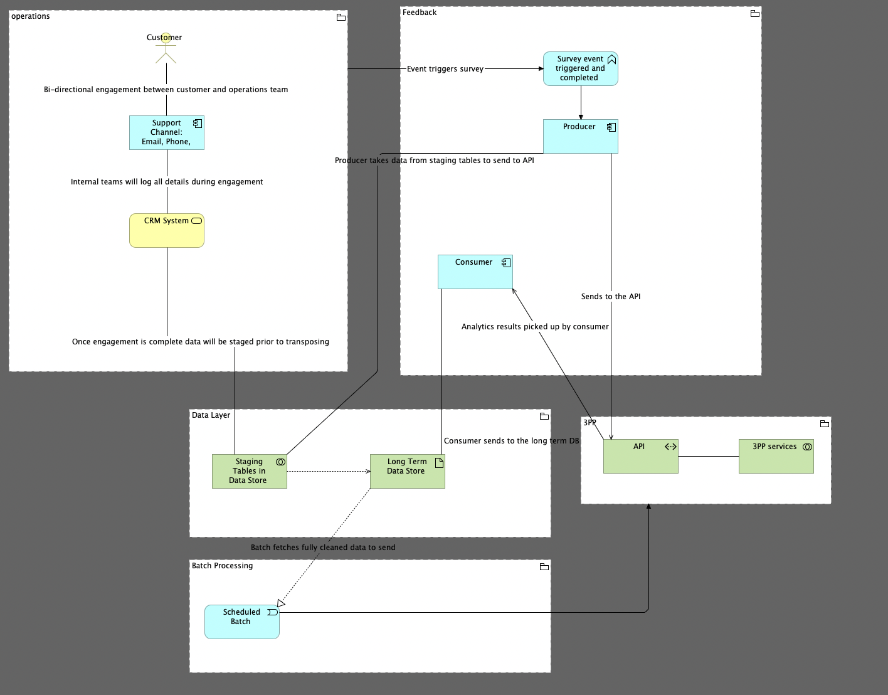

# Solution Design Blueprints: Event-Driven Feedback & Batch Pipeline

## Project Overview

This repository contains a conceptual solution design and reference architecture for a decoupled, event-driven customer feedback system integrated with asynchronous batch reconciliation layers.

The goal of this design is to handle high-volume user interactions across multiple support channels, capture synchronous customer sentiment metadata into an ingestion buffer, and process data asynchronously to protect core transactional databases while syncing with external platforms.

---

## Repository Artifacts

| Artifact | Description |
|---|---|
| [Sanitized_TechStack_Solution_Design.pdf](./Sanitized_TechStack_Solution_Design.pdf) | Detailed solution design blueprint (3 pages) covering the architectural narrative, functional topology, and multi-tenant isolation matrix. |
| [Survey flow.archimate](./Survey%20flow.archimate) | Editable ArchiMate 3.1 model source file. Open in the free [Archi tool](https://www.archimatetool.com/) to explore and modify the architecture. |
| [docs/architecture_diagram.png](./docs/architecture_diagram.png) | Rendered architecture diagram exported from the ArchiMate model. |

---

## System Architecture Model (ArchiMate 3.1)

Below is the conceptual system topography mapped using the ArchiMate enterprise architecture framework. It isolates operations, real-time feedback flows, long-term data persistence, and scheduled integration loops.

### Key Architectural Layers

### 1. Operational Layer
* **Customer Interaction:** Captures bi-directional engagement across various communication interfaces (Email, Phone, Chat).
* **Case Management:** Handles operational ticketing workflows, updating state synchronously to an isolated Operational Data Store (ODS).

### 2. Feedback Ingestion & Integration
* **Asynchronous Event Trigger:** Closing an active operational ticket fires an immediate `Survey Triggered` lifecycle event.
* **Ingestion Buffer:** Survey payloads are written directly to a staging table layer rather than production analytical databases to maximize throughput and minimize database locking.
* **Outbound Gateway:** An automated publication worker drains the staging buffer and streams transactional payloads out via an external-facing API.

### 3. External Platform & Reconciliation Layer
* **Reconciliation Loop:** A Python-based ingestion worker executes a decoupled "pull" pattern to fetch processing status from the external 3rd-Party Platform (3PP).
* **Consumer Queue:** Events pass through a consumer message queue to manage throttling and write final states cleanly into the long-term Analytics Data Store.

### 4. Scheduled Multi-Tenant Batch Processing
To support multi-tenant SaaS data isolation guidelines, a dedicated Batch Orchestrator handles heavy analytical syncs at specified system intervals:
* **Enrichment Sync (12-Hour Interval):** Hydrates customer interaction data with deeper analytical context.
* **Metadata Syncs (Batch Intervals):** Dispatches specialized User and Tenant (Organization) profile documents via parallel dedicated APIs to ensure clean account segregation.

---

## Technology Stack

| Component | Technology |
|---|---|
| Event Streaming | Apache Kafka |
| Worker Daemons | Python (Producer & Consumer) |
| Data Stores | Relational Database (Staging + Long-term Analytics) |
| External Integration | REST API (JSON) |
| Architecture Modelling | ArchiMate 3.1 (Archi Tool) |

---

## Non-Functional Requirements & Design Considerations

### Failure Handling
* **Dead Letter Queue (DLQ):** Messages that fail processing after maximum retry attempts are routed to a dedicated DLQ topic for manual inspection and reprocessing.
* **Retry Strategy:** Exponential backoff with jitter on transient failures (network timeouts, 429 rate limits), capped at 5 retry attempts.
* **Idempotency:** All survey event payloads include a unique correlation ID, enabling consumers to detect and discard duplicate deliveries safely.

### Security & Privacy
* **Data Encryption:** All data at rest in staging and long-term stores is encrypted (AES-256). Data in transit uses TLS 1.2+.
* **API Authentication:** The 3PP REST API gateway uses OAuth 2.0 bearer tokens with short-lived access tokens and refresh rotation.
* **PII Handling:** Survey payloads containing personally identifiable information are tokenized before staging to minimize exposure surface.

### Observability
* **Structured Logging:** All producer and consumer daemons emit JSON-structured logs with correlation IDs for end-to-end traceability.
* **Metrics:** Kafka lag, throughput, error rates, and processing latency are exported to a monitoring backend.
* **Alerting:** Automated alerts fire on consumer lag exceeding threshold, DLQ message accumulation, and API gateway error rate spikes.

### Performance Targets (Indicative)
| Metric | Target |
|---|---|
| End-to-end survey event latency | < 30 seconds (p95) |
| Throughput | 10,000 events/hour sustained |
| API gateway availability | 99.9% |
| Consumer lag recovery | < 5 minutes from incident |

---

## Assumptions & Constraints

* This is a conceptual reference design, not a production implementation.
* Technology selections (Kafka, Python, relational DB) represent standard industry choices but are interchangeable with equivalents (e.g., RabbitMQ, Go, NoSQL).
* Multi-tenant isolation assumes logical separation within shared infrastructure; physical isolation would require additional controls.
* The 3PP is an abstract external platform — actual API contracts, rate limits, and authentication schemes would be defined during implementation.

---

## Proposed Implementation Phases

1. **Phase 1 — Core Pipeline:** Stand up Kafka cluster, staging tables, and the producer/consumer daemons for the primary survey event flow.
2. **Phase 2 — 3PP Integration:** Implement the outbound gateway, reconciliation loop, and long-term analytics store.
3. **Phase 3 — Batch Orchestration:** Add the scheduled multi-tenant sync jobs (enrichment, user data, organization files).
4. **Phase 4 — Hardening:** Implement DLQ, retry logic, idempotency checks, monitoring dashboards, and alerting.

---

## License

This project is licensed under the [MIT License](./LICENSE).
